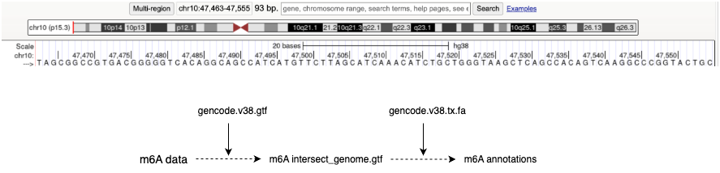

# Multi-omics annotations
We usually adopt different types of data from different sources/labs/technologies, such as ATAC-seq, m6A-seq, eCLIP-seq, icSHAPE-seq etc. Inegrating multi-omics data is paramount for people who conduct# research in bioinformatics. And the dataset we fetch is the *bed file format. It contains the absolute coordinates of each modification sites. But before training the deep learning model, we usually need to align thess datasets onto whole transcriptome, and get the relative coordinates onto the transcript. Here, I shared a pipeline to teach beginners in bioinformatics and compbio how to integrate different types of omics.

## Illustration
Fig1.    

## preparation
Firstly, you should download human annotation file-gencode.v38.annotation.gtf from ensembl and hg38.fa from NCBI. 
Then, you should use **star** to fetch transcript sequence. Notice! The RNA sequence of gene on minus strand must be reversed.   
```
cd gtf
wget https://ftp.ebi.ac.uk/pub/databases/gencode/Gencode_human/release_47/gencode.v47.chr_patch_hapl_scaff.annotation.gtf.gz
gzip -d gencode.v38.annotation.gtf.gz
```
Then, you should install bedtools. You should link the pages of [bedtools](https://github.com/arq5x/bedtools2/releases)
```
wget https://github.com/arq5x/bedtools2/archive/refs/tags/v2.31.1.tar.gz
tar -xvf v2.31.1.tar.gz
cd bedtools2-2.31.1
make
```
then, you should add the bedtools2-2.31.1/bin into your ~/.bashrc and source it. 

## modles
- eCLIP-seq + m6A integration.
```

```
- ATAC-seq + eCLIP overlap

## Example
See jupyter notebook

## License

This project is licensed under the MIT License - see the [LICENSE](LICENSE) file for details.
